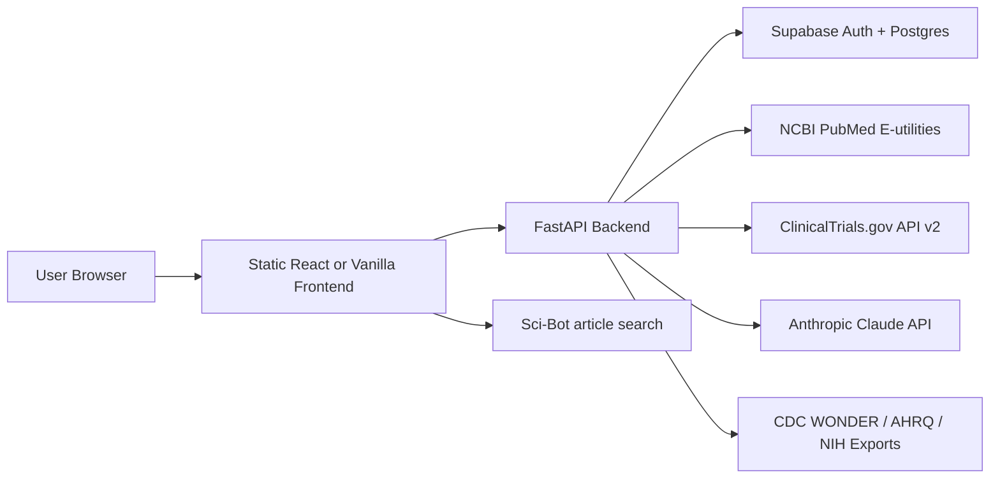

# CommonAxon Data Architecture

## Product Name

The public-facing name in this prototype is **CommonAxon**. It keeps the health equity thesis, but the name is shorter, easier to say, and more memorable for a public demo.

## Modules

| Module | User Job | Prototype Data | Production Data |
| --- | --- | --- | --- |
| Disparity Atlas | Explore incidence, diagnosis access, and outcome gaps by disease, geography, source layer, and community lens | Deterministic sample values in `app.js` with broad multi-select filters | CDC WONDER exports, AHRQ disparities files, NIH/NINDS datasets, county-level public health files |
| Research Hub | Search papers in PubMed or Sci-Bot | NCBI PubMed E-utilities in-browser fetch plus Sci-Bot query links | FastAPI proxy for PubMed, cached results, user-saved searches in Supabase |
| AI Translator | Translate abstracts into patient, advocate, peer, and public outputs | Local deterministic summarizer | Anthropic Claude API called through a secure backend function |
| Trial Finder | Find active trials and evaluate access barriers | ClinicalTrials.gov API v2 in-browser fetch with fallback examples | FastAPI proxy, trial enrichment, saved trial lists |
| Portfolio | Keep a reflective research log, GitHub profile link, and resource connector | LocalStorage research notes, resources, GitHub URL, JSON import, JSON/CSV export | Supabase tables, approved research artifacts, optional file storage |

## Core Entities

### users

| Field | Type | Notes |
| --- | --- | --- |
| id | uuid | Supabase auth user id |
| name | text | Display name |
| email | text | Unique |
| identity_tags | text[] | Optional self-described tags |
| github_profile_url | text | Optional public GitHub profile |
| created_at | timestamptz | Default now |

### saved_searches

| Field | Type | Notes |
| --- | --- | --- |
| id | uuid | Primary key |
| user_id | uuid | References users |
| source | text | `PubMed`, `ClinicalTrials.gov`, `Resources`, `Atlas` |
| query | text | Original query |
| filters | jsonb | Date range, disease, geography, community lens |
| created_at | timestamptz | Default now |

### research_notes

| Field | Type | Notes |
| --- | --- | --- |
| id | uuid | Primary key |
| user_id | uuid | References users |
| lens | text | User-defined tag or lens |
| body | text | Reflection |
| entry_date | date | User-selected note date |
| mood | text | Optional mood or energy label |
| prompt | text | Reflection prompt |
| ai_feedback | jsonb | Claude-generated personal statement scaffolding |
| visibility | text | `private`, `mentor`, `public` |
| created_at | timestamptz | Default now |

### community_resources

| Field | Type | Notes |
| --- | --- | --- |
| id | uuid | Primary key |
| name | text | Resource name |
| type | text | Care, advocacy, trials, pipeline, research |
| communities | text[] | Broad population, access, and care-context tags |
| description | text | Short plain-language description |
| url | text | External source |
| verified_at | date | Last manual verification date |

### research_records

| Field | Type | Notes |
| --- | --- | --- |
| id | uuid | Primary key |
| external_id | text | PMID, DOI, or NCT id |
| source | text | PubMed, ClinicalTrials.gov, portfolio |
| title | text | Record title |
| authors | jsonb | Author list |
| abstract | text | Optional cached abstract |
| metadata | jsonb | Journal, year, trial status, locations |
| created_at | timestamptz | Default now |

### translations

| Field | Type | Notes |
| --- | --- | --- |
| id | uuid | Primary key |
| user_id | uuid | References users |
| research_record_id | uuid | Optional reference |
| input_text | text | Submitted abstract or summary |
| patient_summary | text | Plain language output |
| advocate_summary | text | Community action output |
| peer_summary | text | Scientific synthesis |
| public_brief | text | Policy or social media output |
| model | text | Claude model name |
| created_at | timestamptz | Default now |

## Service Flow

## Launch Path

1. Deploy this static prototype to Vercel, Netlify, GitHub Pages, or any static host.
2. Replace localStorage auth with Supabase Auth.
3. Add FastAPI endpoints for PubMed, ClinicalTrials.gov, Claude translation, and dataset ingestion.
4. Load public health data from documented CSV exports before building a live CDC WONDER integration.
5. Replace portfolio placeholders only with NINDS-approved, non-sensitive work samples.
